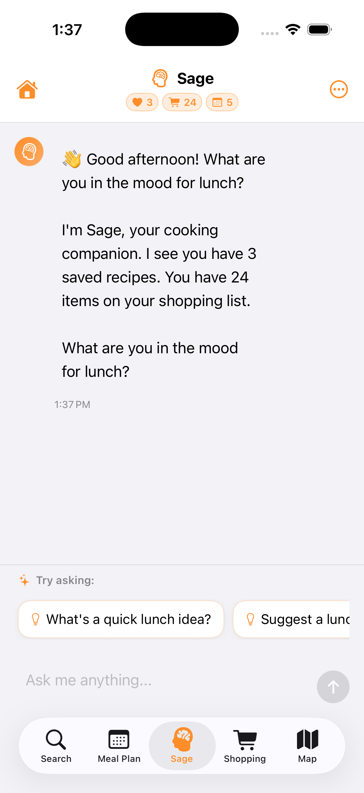
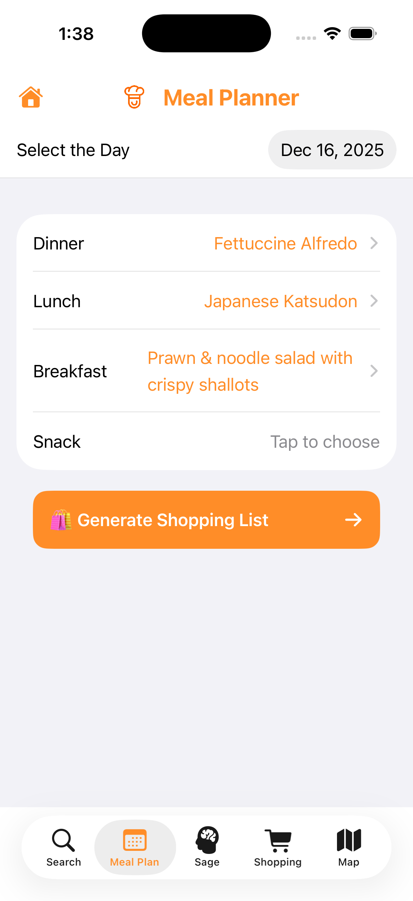
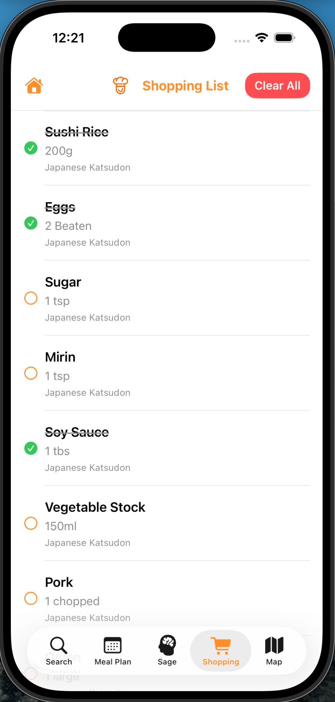
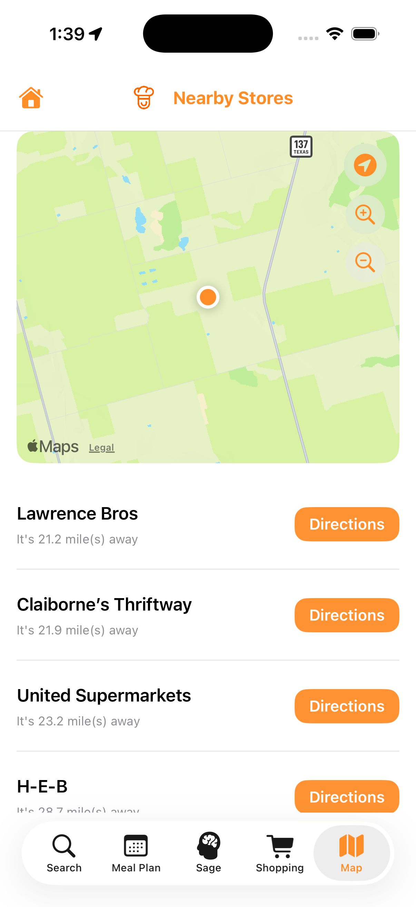
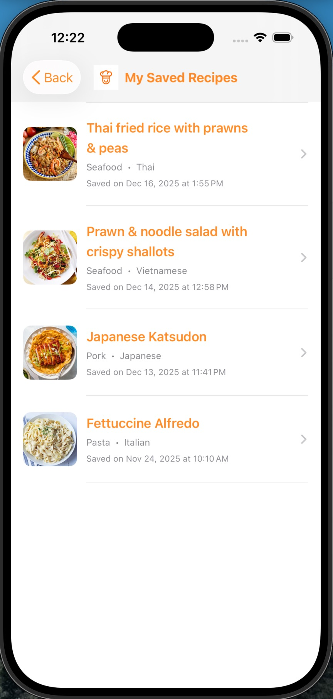
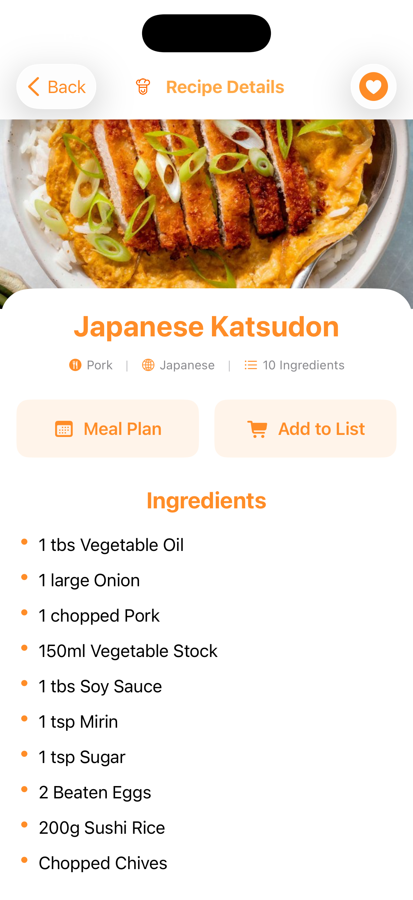

<h1 align="center">RecipeScout 🍳</h1>

<p align="center">
  
</p>

<p align="center">
  <strong>Your AI-Powered Cooking Companion for iOS<strong> 
</p>

---

RecipeScout is a cutting-edge iOS application that revolutionizes meal planning and recipe discovery through the power of artificial intelligence. Built with SwiftUI and featuring **Sage** - an intelligent cooking assistant powered by Anthropic's Claude Sonnet 4.5 - RecipeScout provides context-aware cooking guidance, smart meal planning, automated shopping lists, and nearby grocery store discovery all in one seamless experience.

---

## ✨ Features

### 🧠 Sage AI Assistant - Your Intelligent Cooking Companion
- **Claude-Powered Conversations**: Natural, context-aware cooking assistance powered by Anthropic's Claude Sonnet 4.5
- **Time-Aware Recommendations**: Smart meal suggestions based on current time of day (breakfast, lunch, dinner, snacks)
- **Privacy-First Design**: User-controlled data access with transparent privacy settings
- **Context-Aware Intelligence**: Sage analyzes your saved recipes, meal plans, and shopping list to provide personalized advice
- **Cooking Expertise**: Get instant help with ingredient substitutions, cooking techniques, and nutritional information
- **Quick Action Suggestions**: Smart suggestion buttons for common queries and meal planning assistance
- **Real-Time Typing Indicators**: Engaging conversation experience with animated responses

### 🔍 Recipe Discovery & Search
- **Comprehensive Recipe Database**: Search thousands of recipes powered by TheMealDB API
- **Advanced Search Capabilities**: Find recipes by name, category, cuisine, or area
- **Detailed Recipe Information**: View ingredients, step-by-step instructions, and high-quality images
- **YouTube Integration**: Watch cooking tutorials directly from recipe details
- **Multi-Category Browsing**:  Explore recipes by cuisine type and dietary preferences

### ❤️ Personal Recipe Collection
- **SwiftData Persistence**: Save your favorite recipes with reliable local storage
- **Organized Library**: Manage and browse your personal recipe collection
- **Quick Access**: Instant access to all your saved recipes from dedicated view
- **Seamless Integration**:  Saved recipes sync with Sage AI for personalized recommendations

### 📅 Smart Meal Planner
- **Calendar-Based Planning**: Visual meal planning with intuitive calendar interface
- **Multi-Meal Support**: Plan breakfast, lunch, dinner, and snacks for any date
- **Drag & Drop Interface**: Easy meal scheduling with smooth interactions
- **Recipe Integration**: Add recipes directly from search or saved collection to your meal plan
- **Flexible Management**: Edit, remove, or rearrange planned meals effortlessly
- **AI Integration**: Sage can review and provide insights on your meal plan

### 🛒 Intelligent Shopping List
- **Auto-Generated Lists**: Automatically create shopping lists from your meal plans
- **Manual Entry**: Add custom items with quantities and notes
- **Check-Off System**: Mark items as completed while shopping
- **Smart Organization**: Items grouped and organized for efficient shopping
- **Clear Completed Items**: One-tap removal of checked items
- **AI Shopping Assistant**: Ask Sage for recipe suggestions based on your shopping list items

### 🗺️ Store Locator
- **MapKit Integration**: Find nearby grocery stores using Apple Maps
- **Interactive Map View**:  Explore store locations with pins and detailed information
- **Location Services**: Automatic detection of your current location
- **Directions Support**: Get navigation assistance to selected stores
- **Real-Time Updates**: Live map data with current store information

---

## 🛠️ Technologies Used

### Core Technologies
- **SwiftUI**:  Modern declarative UI framework for iOS 17+
- **Swift 5.9**: Latest Swift features with enhanced concurrency and performance
- **Xcode 15+**:  Cutting-edge development environment with advanced debugging tools

### AI & Machine Learning
- **Claude API**: Anthropic's Claude Sonnet 4.5 for intelligent conversational AI
- **Context Management**: Advanced context building system for personalized AI responses
- **Time-Based Intelligence**: Smart meal suggestions using time-of-day analysis
- **Privacy-Aware AI**: User-controlled data access with transparent permissions

### Data Persistence & State Management
- **SwiftData**:  iOS 17+ persistent storage framework for local data management
- **Combine Framework**: Reactive programming for API calls and data flow
- **MVVM Architecture**: Clean separation of concerns with ViewModels and Views
- **ObservableObject Pattern**: Reactive state management for real-time UI updates

### Networking & APIs
- **URLSession**: Native networking with custom configuration and timeout handling
- **TheMealDB API**: Comprehensive recipe database with detailed meal information
- **Claude API Integration**: Secure API communication with rate limiting and retry logic
- **Async/Await**: Modern concurrency for efficient asynchronous operations

### Location & Maps
- **MapKit**: Native Apple Maps integration for store discovery
- **CoreLocation**: Precise location tracking with privacy-first permissions
- **Location Services**: Background location updates and region monitoring
- **Map Annotations**: Custom pins and callouts for enhanced user experience

### UI/UX & Design
- **SwiftUI Components**: Native components with custom styling and animations
- **Custom Views**: Reusable components for consistent design language
- **Animations**:  Smooth transitions and micro-interactions using SwiftUI animations
- **Responsive Layouts**: Adaptive designs for all iOS device sizes
- **Dark Mode Support**: Full dark mode compatibility with system preferences
- **SF Symbols**: Apple's comprehensive icon library for consistent iconography

### Development & Architecture
- **Environment Configuration**: Secure `.env` file management for API keys
- **Modular Architecture**: Clean code organization with Models, Views, ViewModels, and Configuration
- **Type Safety**: Strongly typed Swift code for reliability and maintainability
- **Protocol-Oriented Design**: Flexible and testable code architecture
- **Error Recovery**: Graceful error handling with user guidance and retry mechanisms

### Security & Privacy
- **Secure API Key Storage**: Environment variables for sensitive credentials
- **Privacy Controls**: User-managed data access for AI assistant
- **Location Privacy**: Transparent location permission handling
- **Data Encryption**: SwiftData encryption for local storage
- **Rate Limiting**: API request throttling to prevent abuse

---

## 📋 Requirements

- **Xcode**:  15.0 or later
- **iOS**:  17.0 or later
- **Swift**: 5.9 or later
- **macOS**:  Sonoma (14.0) or later for development
- **Apple Developer Account**: For device testing and deployment

---

## 🚀 Getting Started

### 1️⃣ Clone the Repository

```bash
git clone https://github.com/X-XENDROME-X/RecipeScout.git
cd RecipeScout
```

### 2️⃣ Configure Environment Variables

Copy the template file and configure your API keys:

```bash
cp .env.template RecipeScout/Configuration/. env
```

Edit `RecipeScout/Configuration/.env` and add your API configuration:

```env
# TheMealDB API Configuration
# Get your API from https://www.themealdb.com/api.php
# For testing, you can use: https://www.themealdb.com/api/json/v1/1
API_BASE_URL=https://www.themealdb.com/api/json/v1/1

# Claude API Configuration
# Get your API key from https://console.anthropic.com/
CLAUDE_API_KEY=your_claude_api_key_here
```

> **Note**: The Claude API key is required for Sage AI assistant functionality.  Sign up at [Anthropic Console](https://console.anthropic.com/) to obtain your API key.

### 3️⃣ Open in Xcode

```bash
open RecipeScout. xcodeproj
```

### 4️⃣ Add . env File to Xcode

1. In Xcode, drag `RecipeScout/Configuration/.env` into the Project Navigator
2. In the dialog, **check** "RecipeScout" under "Add to targets"
3. Click "Finish"

### 5️⃣ Configure Signing & Capabilities

1. Select the **RecipeScout** project in Project Navigator
2. Select the **RecipeScout** target
3. Go to **Signing & Capabilities** tab
4. Select your **Team** from the dropdown
5. Xcode will automatically manage provisioning

### 6️⃣ Build and Run

- Select a simulator (iPhone 15 Pro recommended) or physical device
- Press `⌘R` or click the Play button
- The app will launch with full functionality

---

## 📁 Project Structure

```
RecipeScout/
├── RecipeScout/
│   ├── RecipeScoutApp.swift              # App entry point with SwiftData configuration
│   ├── APIService.swift                   # Network layer for TheMealDB API
│   │
│   ├── Configuration/
│   │   ├── EnvironmentConfig.swift       # Environment variable loader and validator
│   │   ├── ClaudeAPIService.swift        # Claude API communication with rate limiting
│   │   ├── ClaudeError.swift             # Comprehensive error handling for AI
│   │   ├── ClaudePromptBuilder.swift     # AI prompt engineering and context building
│   │   ├── AIAssistantView.swift         # Sage AI chat interface
│   │   ├── AIAssistantViewModel.swift    # AI conversation state management
│   │   ├── AIContextManager.swift        # User context aggregation for AI
│   │   ├── AIInputBar.swift              # Message input with send functionality
│   │   ├── TimeContextHelper.swift       # Time-based meal recommendations
│   │   ├── QuickActionButtons.swift      # Smart suggestion buttons
│   │   ├── TypingIndicatorView.swift     # Animated typing indicator
│   │   ├── . env. template                 # Template for API configuration
│   │   └── .env                          # Your API config (gitignored)
│   │
│   ├── Models/
│   │   ├── Recipe.swift                  # Recipe data model (API response)
│   │   ├── SavedRecipe.swift             # Saved recipe (SwiftData model)
│   │   ├── MealPlanEntry.swift           # Meal plan entry (SwiftData model)
│   │   └── ShoppingItem.swift            # Shopping list item (SwiftData model)
│   │
│   ├── ViewModels/
│   │   └── RecipeViewModel.swift         # Recipe business logic and API calls
│   │
│   └── Views/
│       ├── ContentView.swift             # Main navigation container
│       ├── HomeView.swift                # Welcome screen with app navigation
│       ├── SearchView.swift              # Recipe search with filters
│       ├── RecipeDetailView.swift        # Detailed recipe information
│       ├── SavedRecipesView.swift        # Personal recipe collection
│       ├── MealPlannerView.swift         # Calendar-based meal planning
│       ├── ShoppingListView.swift        # Shopping list management
│       └── MapView.swift                 # Store locator with MapKit
│
├── RecipeScout. xcodeproj/                # Xcode project configuration
├── . gitignore                            # Git ignore rules
├── . env.template                         # Root environment template
├── README.md                             # This file
└── LICENSE                               # MIT License
```

---

## 📱 Screenshots

### Search View


*Discover thousands of recipes with powerful search and filtering capabilities*

---

### Sage AI Assistant

  


*Chat with Sage, your intelligent cooking companion powered by Claude AI*

---

### Meal Planner

  


*Plan your meals with an intuitive calendar-based interface*

---

### Shopping List

  


*Auto-generated shopping lists from your meal plans with check-off functionality*

---

### Map View

  


*Find nearby grocery stores with integrated Apple Maps*

---

### Saved Recipes

  


*Access your personal collection of favorite recipes anytime*

---

### Recipe Detail

  


*View comprehensive recipe information with ingredients and instructions*

---

## 🎯 Usage

### For Home Cooks
- **Discover Recipes**: Browse and search thousands of recipes by cuisine, category, or ingredients
- **Chat with Sage**: Ask cooking questions, get ingredient substitutions, and receive personalized recommendations
- **Plan Meals**:  Organize your weekly meals with the intuitive calendar interface
- **Auto Shopping Lists**: Generate shopping lists automatically from your planned meals
- **Save Favorites**:  Build your personal recipe collection for quick access
- **Find Stores**:  Locate nearby grocery stores with integrated map navigation

### For Meal Planners
- **Weekly Planning**: Plan entire weeks of meals across all meal types
- **Recipe Organization**: Organize recipes by cuisine, dietary preferences, and cooking time
- **AI Recommendations**: Get meal suggestions based on your preferences and dietary needs
- **Shopping Efficiency**: Consolidated shopping lists prevent duplicate purchases

### For AI Enthusiasts
- **Context-Aware AI**: Experience how AI adapts to your cooking habits and preferences
- **Privacy Controls**: Manage what data Sage can access for personalized assistance
- **Time-Based Intelligence**: See how AI provides relevant suggestions based on time of day
- **Conversational Interface**: Natural language processing for intuitive cooking guidance

---

## 🏗️ Key Features In-Depth

### Sage AI Assistant - Intelligent Cooking Companion

RecipeScout's standout feature is **Sage**, an AI-powered cooking assistant that provides: 

#### **Context-Aware Intelligence**
Sage analyzes your cooking habits, saved recipes, meal plans, and shopping lists to provide personalized recommendations.  The AI understands your preferences and adapts its suggestions accordingly.

#### **Time-Based Recommendations**
Sage automatically adjusts its suggestions based on the current time of day: 
- **Morning (6AM-10AM)**: Breakfast ideas and quick morning recipes
- **Midday (11AM-2PM)**: Lunch suggestions and light meal options
- **Evening (5PM-9PM)**: Dinner recipes with more elaborate cooking options
- **Late Night**:  Snack ideas and light bite recommendations

#### **Privacy-First Design**
Users have complete control over what data Sage can access:
- Toggle access to saved recipes
- Control meal plan visibility
- Manage shopping list data sharing
- All data stays on-device with SwiftData

#### **Advanced Prompt Engineering**
RecipeScout implements sophisticated prompt engineering techniques:
- System prompts with comprehensive context building
- User data aggregation for personalized responses
- Error handling with graceful degradation
- Rate limiting and retry logic for reliability

#### **Conversational Flow**
Sage provides an engaging chat experience:
- Real-time typing indicators during AI processing
- Quick action buttons for common queries
- Message history with conversation continuity
- Welcome messages with time-aware greetings

### Recipe Discovery System

The recipe search leverages TheMealDB's extensive database:
- **Search by Name**: Find recipes with intelligent query matching
- **Category Filtering**: Browse by meal type, cuisine, or dietary preference
- **Area Search**:  Discover authentic regional recipes
- **Detailed Information**:  Ingredients with measurements, step-by-step instructions, and nutritional info
- **Visual Content**: High-quality images and YouTube video tutorials

### Meal Planning Intelligence

The meal planner provides a complete weekly organization system:
- **Calendar View**: Visual representation of weekly meal schedule
- **Multi-Meal Types**: Separate planning for breakfast, lunch, dinner, and snacks
- **Recipe Integration**: Add any recipe from search or saved collection
- **Flexible Editing**:  Modify or remove planned meals anytime
- **AI Integration**:  Sage reviews your meal plan and provides nutritional insights

### Shopping List Automation

The shopping list system streamlines grocery shopping:
- **Auto-Generation**: Create lists from meal plan ingredients automatically
- **Manual Additions**: Add custom items with quantities
- **Check-Off System**: Mark items completed while shopping
- **Organization**: Items grouped logically for efficient shopping
- **AI Assistance**: Ask Sage for recipes using your shopping list items

### Store Locator with MapKit

Find grocery stores effortlessly:
- **Location Detection**: Automatic location with privacy permissions
- **Interactive Map**: Explore nearby stores with detailed annotations
- **Store Information**: View store names, addresses, and contact details
- **Navigation**: Get directions to selected stores
- **Search Radius**: Adjust search distance for store discovery

---

## 🔒 Security & Privacy

### Environment Variables
- **Never commit `.env` files** - They are automatically gitignored
- The `.env.template` shows required variables without exposing secrets
- Each user must create their own `.env` file locally with personal API keys

### API Key Management
- **TheMealDB API**: Free public endpoint, obtain your own key for production
- **Claude API**: Requires secure API key from Anthropic Console
- Store all API keys in `.env` file, never hardcode in source files
- API keys are loaded via `EnvironmentConfig` class with validation

### AI & Data Privacy
- **On-Device Storage**: All user data stored locally with SwiftData encryption
- **User-Controlled Access**: Toggle what data Sage can access for AI responses
- **No Cloud Sync**: Recipe collection and meal plans never leave your device
- **Transparent Permissions**: Clear privacy notices about AI data access

### Location Privacy
- **Permission-Based**:  Location access only when user grants permission
- **Purpose Explained**: Clear explanation of location usage for store discovery
- **No Tracking**: Location data used only for map functionality, not stored or transmitted
- **User Control**: Can revoke location permissions anytime in iOS Settings

---

## 🤝 Contributing

This is a personal project showcasing modern iOS development skills, but feedback and suggestions are always welcome! 

### How to Contribute
- **Report Bugs**: Open an issue describing the bug and steps to reproduce
- **Suggest Features**: Share your ideas for new features or improvements
- **Code Review**:  Provide feedback on code architecture and best practices
- **Documentation**: Help improve README and code documentation

---

## 📄 License

This project is licensed under the MIT License - see the [LICENSE](LICENSE) file for details.

---

## 🙏 Acknowledgments

RecipeScout leverages several APIs and technologies: 

- **Recipe Data**: [TheMealDB](https://www.themealdb.com/) - Comprehensive recipe database with detailed meal information
- **AI Technology**: [Anthropic Claude](https://www.anthropic.com/) - Advanced conversational AI for intelligent cooking assistance
- **Icons**: SF Symbols - Apple's comprehensive symbol library for consistent iconography
- **Development**:  Built with using SwiftUI, SwiftData, and modern iOS development practices

---

## 📞 Support

If you encounter any issues or have questions: 

1. **Check Documentation**: Review this README and code comments
2. **API Keys**: Ensure all API keys are correctly configured in `.env` file
3. **iOS Version**: Verify you're running iOS 17.0 or later
4. **Xcode Version**:  Confirm Xcode 15.0 or later is installed

---

<p align="center">
  <strong>Happy Cooking with RecipeScout! 🍽️</strong>
</p>
